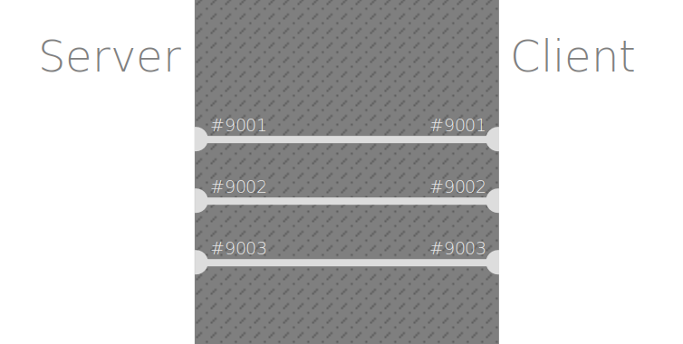

<small>[Home](README.md) / Client-Server Overview</small>

----
# Client-Server Overview

- The hello-world.c program simply prints `Hello, World!` when it gets
  executed.
- The same thing in a client-server setup is that when a client connects
  to a server, the server sends `Hello, World!` to the client.

## Server

On the server, the following happens:

1. Create a **socket**.
    - A socket is an object for communicating both ways (in+out) with others over some kind of connection.
    - A socket is similar to a headphone with mic, used to communicate with others by listening (in) and speaking (out).
    - 
2. Bind the socket to a **port**
    - Ports are numbers, e.g. 9001
    - Think of ports as numbered holes in a wall that separating the server and the client
    - 
    - Binding a socket to a port is like plugging the headphones jack into a numbered hole in the wall
    - 
3. Wait for client to connect.
    - It is like waiting for the client to plug it's jack into the other side of the hole that has the _same number_.
4. When client connects, send and receive data.
    - In the very first version, when a client connection is detected, send `Hello, World!` to the client.

## Client

On the client, the following happens:
1. Create a socket.
2. Connect the socket to the port on the server
3. Send and receive data
